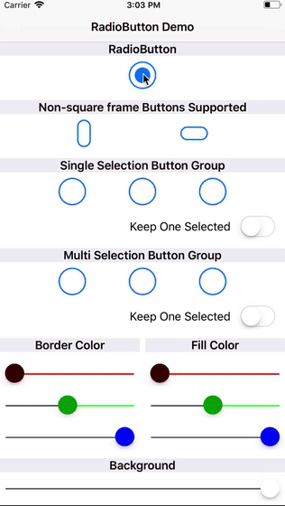

# RadioButton
Radio Buttons aren't really a think on iOS, but have you ever wanted them to be a thing? Yes? Maybe? No? If you are one of the first two, have I got great new for you!

# Quick Preview

# Components
While this README has a bit of an overview. [Click Here for documentation](docs/index.html).

## RadioButton
The `RadioButton` is a single component that can be used by itself or in a `RadioButtonGroup`.

There is not a whole lot too them which makes them pretty easy to use, they are even IBDesignable. `RadioButton`s can have a delegate that control behaviour such as stopping a state change.

## RadioButtonGroup
The `RadioButtonGroup` manages a grouping of buttons by controlling some behaviours. This includes having only one button selected, many selected, and even if they should change state.
